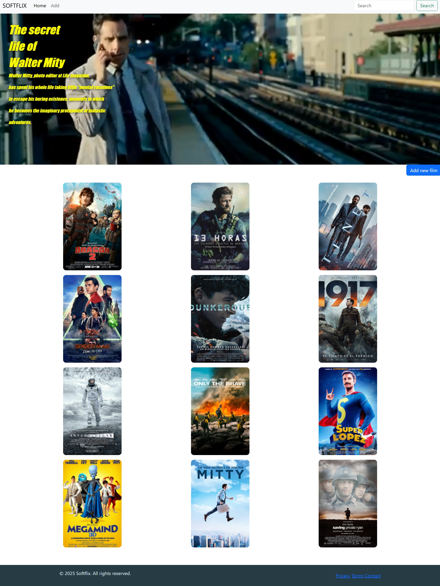
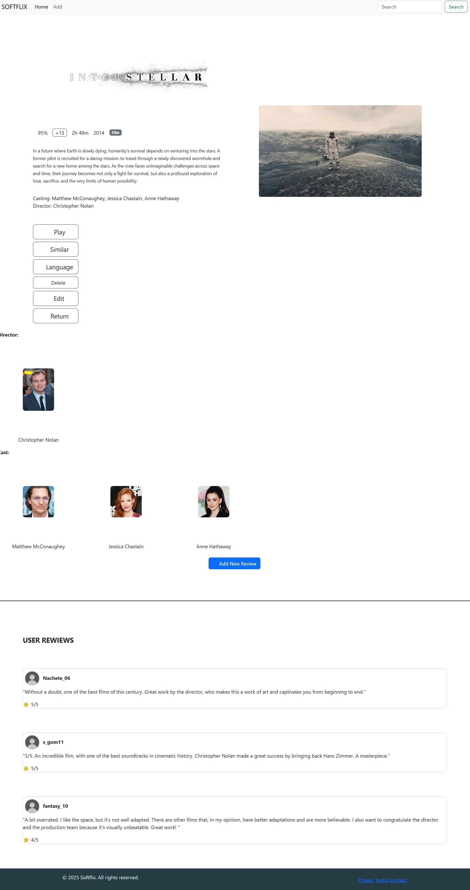

#  Softflix
---
##  Team members 
- **Ignacio de Diego Valera**  
  -  Mail: i.dediego@alumnos.urjc.es  
  -  GitHub: [@Ignacioddv](https://github.com/Ignacioddv)
- **Samuel Jesús Gómez Martín**  
  -  Mail: sj.gomez.2024@alumnos.urjc.es  
  -  GitHub: [@samugm0](https://github.com/samugm0)
- **Raúl García Piedra**  
  -  Mail: r.garciapi.2024@alumnos.urjc.es  
  -  GitHub: [@Raulgrp7](https://github.com/Raulgrp7)
##  Functionality
- In this web site we will have a catalog of different films with all the  needed and intuitive information through images, also counting with another part that helps  in the searching of the films and an extra web page that contains more information of each film.
###  Entities
- **Main Entity: Films**  
  - Attributes: 
    - `Image`  
    - `Name`
    - `Information`
    - `Rating (1-5)`
    - `Genders (Action, Adventure, Comedy, Science Fiction, Horror, Fantasy)`
    - `Rating_by_age`
    - `Languages (Spanish, English, French, German)`

- **Secondary Entity: User Reviews**  
  - Attributes:   
    - `User_image`  
    - `User_name`
    - `Review`
    - `Rating (1-5)`

---

###  Images
- Main entity: associated with an image.  
- Secondary entity: associated with an image.  
---
###  Search, filtering or categorization
- Type of actions that can be made:  
  - Search by movie name.  
  - Filter by movie genre.  
  - Rank according to the score of each movie.
  - Filter by age rating.

---

### Practica 1
-**Web Images**
  - Index page
    

      
    

  - Ej page
    

      
    

  - Add/Edit page
    

      
    

  
- Ignacio: I have mainly participated in three documents: indice.html, Formulario.html and style.css. I have been supervising all of the code, watching the comments, that all of the code was tidy and erasing code that we didn´t use in any of the files.
  - Commits: (https://github.com/CodeURJC-FW-2025-26/webapp16/commit/53c87d31d7d29ea8b967139c66de71cf5a400143)
             (https://github.com/CodeURJC-FW-2025-26/webapp16/commit/dc384734e017a231c924947321f72293b05283c1)
             (https://github.com/CodeURJC-FW-2025-26/webapp16/commit/e6c335be488f624c45cd7eb99b46c74095273098)
             (https://github.com/CodeURJC-FW-2025-26/webapp16/commit/944f65e807caf4bd47c24f6cd4bb27a59e89ae4c)
             (https://github.com/CodeURJC-FW-2025-26/webapp16/commit/e76b69543c04cc4ce8ff0d540f00d5eeb165aa0b)
  - Pages: ([indice.html](https://github.com/CodeURJC-FW-2025-26/webapp16/blob/main/indice.html))
           ([Formulario.html](https://github.com/CodeURJC-FW-2025-26/webapp16/blob/main/Formulario.html))
           ([Style.css](https://github.com/CodeURJC-FW-2025-26/webapp16/blob/main/style.css))
           ([README.md](https://github.com/CodeURJC-FW-2025-26/webapp16/blob/main/README.md))
           ([añadir.html](https://github.com/CodeURJC-FW-2025-26/webapp16/blob/main/a%C3%B1adir.html))

- Raúl: I made all the things related to the page for adding a new element, also adding new css and changing the bootstrap default code. I have also been making comments to be the work more explained and reestructuring some code.
  - Commits: (https://github.com/CodeURJC-FW-2025-26/webapp16/commit/27283d88cc58be7151808851284499b3beb85954)
             (https://github.com/CodeURJC-FW-2025-26/webapp16/commit/1b7c0db6deb3cf5946a8bc4ffdbb65332b23dbbd)
             (https://github.com/CodeURJC-FW-2025-26/webapp16/commit/53ef6bf61a52bebf53d99f7242e493f8cd20d3ae)
             (https://github.com/CodeURJC-FW-2025-26/webapp16/commit/ef8e1a192809035f71173618b97a3bb9862aee03)
             (https://github.com/CodeURJC-FW-2025-26/webapp16/commit/cb00938d0917a2e0144db58eeb4be8262336557b)
  
  - Pages:  ([añadir.html](https://github.com/CodeURJC-FW-2025-26/webapp16/blob/main/a%C3%B1adir.html))
            ([Formulario.html](https://github.com/CodeURJC-FW-2025-26/webapp16/blob/main/Formulario.html))
            ([Style.css](https://github.com/CodeURJC-FW-2025-26/webapp16/blob/main/style.css))
            ([README.md](https://github.com/CodeURJC-FW-2025-26/webapp16/blob/main/README.md))
            ([indice.html](https://github.com/CodeURJC-FW-2025-26/webapp16/blob/main/indice.html))

- Samuel: I've done everything related to the detail page, including its corresponding CSS and Bootstrap for both the header, which is common to the entire website, and the style of the buttons and footer. Finally, I've commented out the code for a better understanding. 

   - Commits: (https://github.com/CodeURJC-FW-2025-26/webapp16/commit/a43883438046be23b639b3e8e9bce807a12f7c98)
              (https://github.com/CodeURJC-FW-2025-26/webapp16/commit/4d6474b0abd368fcc2abf64615a56311dc8b4934)
              (https://github.com/CodeURJC-FW-2025-26/webapp16/commit/3a4394169856e17b21cdd15353b0ab8ec3671812)
              (https://github.com/CodeURJC-FW-2025-26/webapp16/commit/6d21f81a5f480d80503fdcbe6cf0477d4e39b98f)
              (https://github.com/CodeURJC-FW-2025-26/webapp16/commit/463ff282443ab1b2e09d04be194ea50019afb4c5)

  - Pages: ([Ej.html](https://github.com/CodeURJC-FW-2025-26/webapp16/blob/main/Ej.html))
           ([Formulario.html](https://github.com/CodeURJC-FW-2025-26/webapp16/blob/main/Formulario.html))
           ([Style.css](https://github.com/CodeURJC-FW-2025-26/webapp16/blob/main/style.css))
           ([README.md](https://github.com/CodeURJC-FW-2025-26/webapp16/blob/main/README.md))
           ([añadir.html](https://github.com/CodeURJC-FW-2025-26/webapp16/blob/main/a%C3%B1adir.html))
           
             

